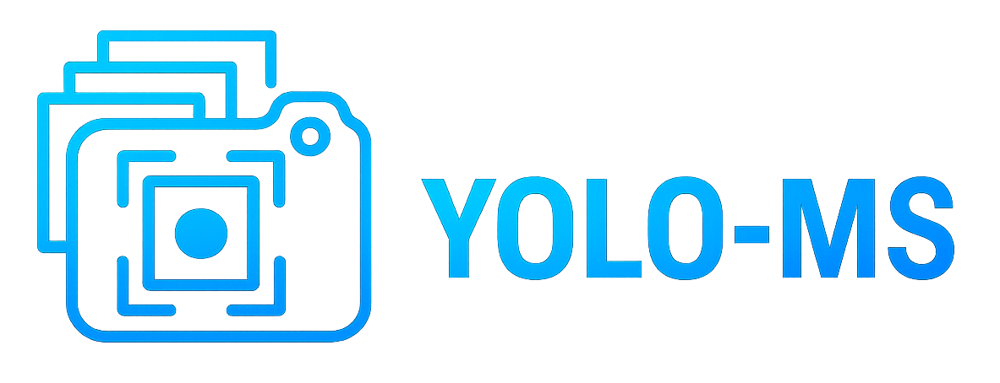
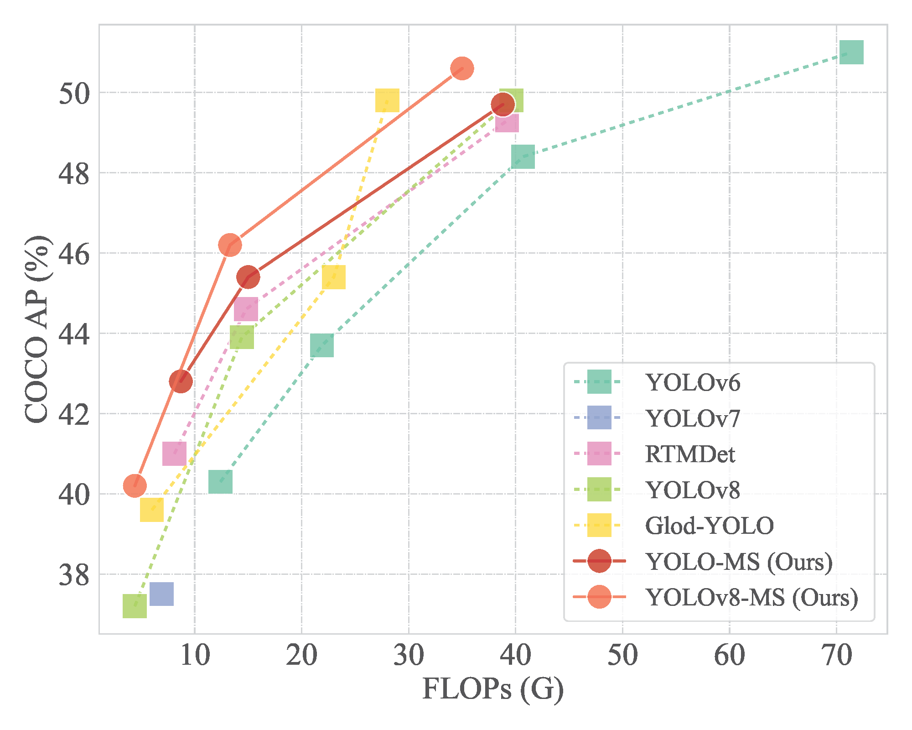
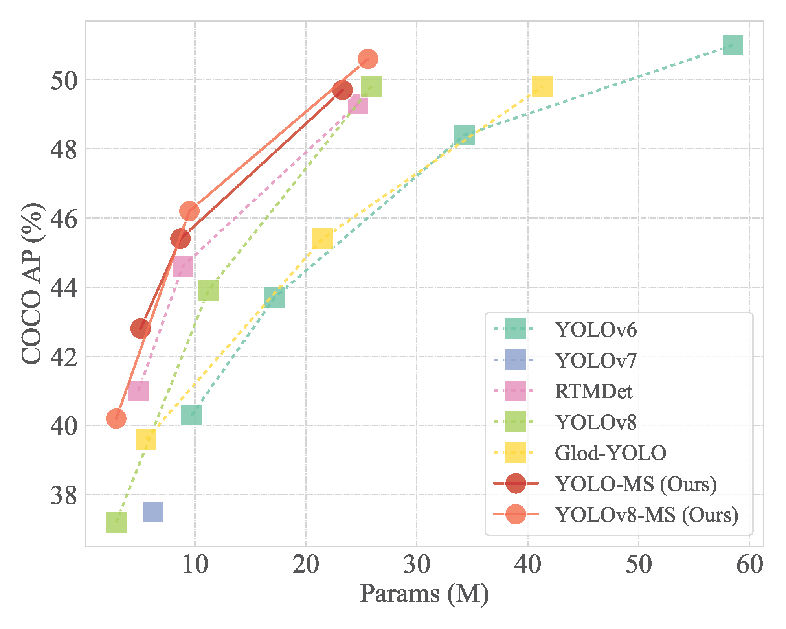

<div align="center">

  <a href="README.md">
    <br/>
  </a>

  <h2 align=center> 
    🚀 Rethinking Multi-Scale Representation Learning for Real-Time Object Detection <br> ⭐ IEEE TPAMI 2025 
  </h2>

  [](https://ieeexplore.ieee.org/document/10872821)
  [](https://mftp.mmcheng.net/Papers/25PAMI-YOLOMS.pdf)
  [](http://www.fishworld.site)
  [](https://huggingface.co/YOLO-MS)
  [](README.md)
  [](https://mp.weixin.qq.com/s/3oXJ1jFj19XHwy6pgPTXHQ)

  [](https://github.com/FishAndWasabi/YOLO-MS/issues)
  [](https://github.com/FishAndWasabi/YOLO-MS/issues)

  📄 [**Table of Contents**](#-table-of-contents) | ✨ [**Page**](http://www.fishworld.site) | ⚔️ [**MMYOLO**](mmyolo/README.md) | 🎻 [**Ultralytics**](ultralytics/README.md)  | 📖 [**Citation**](#-citation-) | 📜 [**License**](#-license-) | ❓ [**FAQ**](https://github.com/FishAndWasabi/YOLO-MS/issues?q=label%3AFAQ+)

</div>

This repository contains the official implementation of the following paper:

> **YOLO-MS: Rethinking Multi-Scale Representation Learning for Real-Time Object Detection**<br/>
> [Yuming Chen](http://www.fishworld.site/), [Xinbin Yuan](https://github.com/YXB-NKU), [Ruiqi Wu](https://rq-wu.github.io/), [Jiabao Wang](https://mmcheng.net/wjb/), [Qibin Hou](https://houqb.github.io/), [Ming-Ming Cheng](https://mmcheng.net)<br/>
> IEEE TPAMI 2025

**Note:** We provide two versions of YOLO-MS in this repository: one is based on [MMYOLO](https://github.com/open-mmlab/mmyolo), maintained by [OpenMMLab](https://openmmlab.com/), and the other is based on [Ultraytics](https://www.ultralytics.com/) (will release soon).

<table>
  <tbody>
    <tr>
        <td>
            
        </td>
        <td>
            
        </td>
    </tr>
    </tbody>
</table>

## 📄 Table of Contents

- [📄 Table of Contents](#-table-of-contents)
- [✨ News 🔝](#-news-)
- [⚔️ MM-YOLO version 🔝](mmyolo/README.md)
- [🎻 Ultralytics version 🔝](ultralytics/README.md)
- [🏡 Model Zoo 🔝](docs/model_zoos.md)
- [🏗️ Supported Tasks 🔝](docs/support_tasks.md)
- [📖 Citation 🔝](#-citation-)
- [📜 License 🔝](#-license-)
- [📮 Contact 🔝](#-contact-)
- [🤝 Acknowledgement 🔝](#-acknowledgement-)

## ✨ News [🔝](#-table-of-contents)

> Future work can be found in [todo.md](docs/todo.md).

- **Jun, 2025**: ⭐ The new code is publicly available! The MMYOLO version is released.
- **Feb, 2025**: 🔥 Our code is also implemented based on [Jittor](https://github.com/Jittor/jittor), and avaliable at [nk-yolo](https://github.com/NK-JittorCV/nk-yolo)!
- **Feb, 2025**: 🔥 Our work is recipient of the [“2024 Outstanding Technical Cooperation Project”](https://cyber.nankai.edu.cn/2025/0225/c13342a563002/page.htm) award from Huawei!
- **Jan, 2025**: ⭐ Our paper is accepted by TPAMI!
- **Dec, 2024**: 🔥 Our work is applied in “Feng Chi Shan Pai” system of Huawei Mate 70 and P70!
- **Aug, 2023**: ⭐ Our code is publicly available!

## 📖 Citation [🔝](#-table-of-contents)

If you find our repo useful for your research, please cite us:

```
@article{Chen2025,
  title = {YOLO-MS: Rethinking Multi-Scale Representation Learning for Real-time Object Detection},
  ISSN = {1939-3539},
  url = {http://dx.doi.org/10.1109/TPAMI.2025.3538473},
  DOI = {10.1109/tpami.2025.3538473},
  journal = {IEEE Transactions on Pattern Analysis and Machine Intelligence},
  publisher = {Institute of Electrical and Electronics Engineers (IEEE)},
  author = {Chen, Yuming and Yuan, Xinbin and Wang, Jiabao and Wu, Ruiqi and Li, Xiang and Hou, Qibin and Cheng, Ming-Ming},
  year = {2025},
  pages = {1–14}
}
```

This project is based on the open source codebase [MMYOLO](https://github.com/open-mmlab/mmyolo).

```
@misc{mmyolo2022,
    title={{MMYOLO: OpenMMLab YOLO} series toolbox and benchmark},
    author={MMYOLO Contributors},
    howpublished = {\url{https://github.com/open-mmlab/mmyolo}},
    year={2022}
}
```

## 📜 License [🔝](#-table-of-contents)

Licensed under a [Creative Commons Attribution-NonCommercial 4.0 International](https://creativecommons.org/licenses/by-nc/4.0/) for Non-commercial use only. Any commercial use should get formal permission first.

## 📮 Contact [🔝](#-table-of-contents)

For technical questions, please contact `chenyuming[AT]mail.nankai.edu.cn`.
For commercial licensing, please contact `cmm[AT]nankai.edu.cn` and `andrewhoux[AT]gmail.com`.

## 🤝 Acknowledgement [🔝](#-table-of-contents)

This repo is modified from open source real-time object detection codebase [MMYOLO](https://github.com/open-mmlab/mmyolo) and [Ultralytics](https://www.ultralytics.com/).

The README file is referred to [LED](https://github.com/Srameo/LED) and [CrossKD](https://github.com/jbwang1997/CrossKD).
